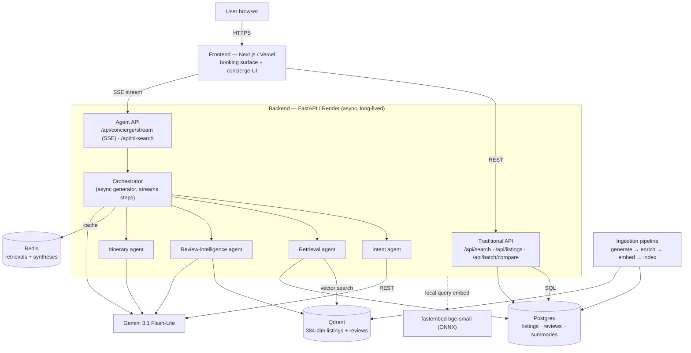

# Travel Discovery AI

AI-native travel discovery & booking — a Booking.com/Airbnb-style product surface with a multi-agent concierge brain underneath. Real booking UX (filters, map, listing pages, calendars, reviews) augmented by natural-language search, semantic retrieval, grounded review synthesis, and multi-stop itinerary planning.

## Project status

| Phase | Scope | Status |
|---|---|---|
| 1 — Data layer | Synthetic generation, ingestion, enrichments, embeddings | ✅ done (dev scale) |
| 2 — Traditional API | Search/filter/sort, availability, detail, reviews, compare | ✅ done & verified |
| 3 — Multi-agent concierge | Intent / Retrieval / Review-intel / Itinerary, SSE streaming | ✅ done & verified |
| 4 — Frontend booking surface | Filters, cards, map↔list, detail, wishlist, compare | ✅ done & verified |
| 5 — Frontend AI integration | NL search bar + chips, streaming concierge UI | ✅ done & verified |
| 6 — Deployment | Public URL (Render + Vercel + Neon + Qdrant Cloud + Upstash) | ⬜ pending |

> **Current data scale:** dev scale (**1,000 listings / 5,000 reviews**, Dubai + Lisbon). The pipeline is parameterized — full **50K/200K** is a single flag (`python ingest.py --scale full`); see [Trade-offs](#key-trade-offs).

## Architecture



**Availability is computed, not stored:** a deterministic `hash(listing_id, date)` function provides per-night availability + price, avoiding ~18M calendar rows.

## Stack & the "why"

| Layer | Choice | Why |
|---|---|---|
| Frontend | Next.js on **Vercel** | Free CDN + HTTPS; serverless is fine for the SPA |
| Backend | FastAPI on **Render** (Docker, long-lived) | SSE streaming needs a long-lived process — serverless timeouts would cut agent streams |
| Relational | **Postgres** (Neon free) | listings + review text + summaries |
| Vector | **Qdrant** (Cloud free 1 GB) | embeddings @ 384-dim, cosine, int8. Relational/vector **split** is the brief's "justify the store split" — Postgres for structured rows, Qdrant for vectors keeps each within free-tier limits |
| Cache | **Redis** (Upstash free) | retrievals + review syntheses cluster heavily |
| LLM | **Gemini 3.1 Flash-Lite** via REST; Claude Haiku fallback | cheap, fast, structured-JSON + SSE; accessed over REST (the `google-generativeai` SDK is deprecated) |
| Embeddings | **bge-small-en-v1.5** (384-dim) via fastembed/ONNX, local | $0, no torch, fits Render free 512 MB; same model for corpus + query so vectors share one space |
| Agent framework | **custom async-generator orchestrator** | first-class SSE step streaming + exact per-step token/latency accounting, lighter than LangGraph/CrewAI for 4 cooperating agents |

## One-command local run

```bash
cp .env.example .env          # set GEMINI_API_KEY (or LLM_PROVIDER=anthropic + ANTHROPIC_API_KEY)
docker compose up --build     # postgres + qdrant + redis + backend + frontend
docker compose run --rm ingestion python ingest.py   # load dev-scale data (~4 min)
```

- Frontend: http://localhost:3000 · Backend + docs: http://localhost:8000/docs
- A pre-built DB dump + Qdrant snapshot for instant restore is a planned optimization (currently you run the ~4-min ingestion once). See [ingestion/README.md](./ingestion/README.md).

## Repo layout

| Path | What | Docs |
|---|---|---|
| `backend/` | FastAPI: traditional search/filter API + streaming multi-agent concierge | [backend/README.md](./backend/README.md) |
| `frontend/` | Next.js booking-style product surface + conversational concierge | [frontend/README.md](./frontend/README.md) |
| `ingestion/` | Re-runnable data generation + ingestion pipeline | [ingestion/README.md](./ingestion/README.md) |
| `docker-compose.yml` | Full local stack | — |

## Data choice

**Synthetic listings/reviews + real photos.** Generated with Faker over per-city geographic bounding boxes (Lisbon, Dubai), with realistic price/bed/amenity/rating distributions and multilingual templated review text (en/pt/ar/es/fr). Photos are **real Airbnb-CDN URLs** assigned deterministically per city from a curated pool, so the UI looks like a genuine product.

*Why synthetic:* fully re-runnable and deterministic (seed-based), no dataset licensing/size friction, and total control over the two-city scope the brief asks for. The pipeline can ingest real data (Inside Airbnb) instead with modest changes.

## Key trade-offs

1. **Dev scale (1K/5K) loaded, not the full 50K/200K.** The pipeline is parameterized (`--scale full`); embedding 250K texts is ~90–140 min CPU. Built and validated at dev scale to iterate fast; full-scale run is a flag flip + one-time embed.
2. **Aspect sentiment is heuristic (English-mostly), not LLM.** The free-tier LLM quota couldn't reliably enrich thousands of reviews, and the templated review text limits LLM marginal value. ~30% of reviews carry aspects (English ~62%; non-English null). The LLM path is fully built + throttled/retried behind `--use-llm` for the paid tier.
3. **Per-property summaries are heuristic** for the same quota reason (toggle `LLM_SUMMARIES=1`).
4. **Deterministic calendar** instead of a calendar table — avoids ~18M rows and fits free tiers; trade-off is synthetic (not real-world) availability.
5. **384-dim embeddings** (not 1536) — keeps the full corpus inside Qdrant's free 1 GB; small quality trade-off for big cost/footprint savings.
6. **Beds-as-capacity proxy** — no `max_guests` column, so guest-count filtering uses `beds`.
7. **Availability filter applies post-DB-pagination**, so search `total` reflects pre-availability counts (acceptable at this scale).
8. **Photos are a shared pool**, not unique per listing (normal for stock-style booking imagery).

## What I'd change with another week

- Run **full 50K/200K** + ship a **pre-built dump + Qdrant snapshot** so `docker compose up` restores in seconds.
- **LLM (or fine-tuned) multilingual aspect sentiment** + LLM summaries at the paid tier; richer LLM-generated review text.
- Move deployment to a **single always-on VM** (Oracle Always-Free / Hetzner ~€4/mo) running the exact `docker-compose` — removes cold starts and the 0.5 GB DB cap.
- Materialized calendar (or PostGIS) so availability filtering is pre-pagination; migrate Qdrant `.search` → `query_points`.
- Real eval harness (see EVAL.md) wired into CI.

## Rough cost per query (back-of-envelope)

Measured from a live concierge trace: ~**800 input / ~270 output tokens** per multi-agent query (intent + itinerary/synthesis + answer). At Gemini 3.1 Flash-Lite rates (~$0.10 / $0.40 per 1M in/out, approximate):

- **Traditional search/filter:** **$0** (no LLM; query embedding is local/free).
- **NL search (intent only):** ~**$0.0001**/query.
- **Full concierge query:** ~**$0.0003–0.001**/query; Redis caching drives repeat-query cost toward $0.

At production scale the per-query LLM cost is unchanged (retrieval over more data stays cheap); the one-time cost is bulk embedding/enrichment at ingest.

## Evaluation

See [EVAL.md](./EVAL.md) for the golden-query set, scoring rubric, and grounding/citation checks.

## Out of scope (per brief)

No auth/accounts, no real payments/booking (Reserve is mocked), stays-only (no flights), no HA/multi-region/autoscaling, laptop-responsive only, no branding.

## Time spent

_Actual hours: TODO — fill in before submission._

## Deployment

See [Deployment runbook](#deployment-path-a--free-tier) below.

## Deployment (Path A — free tier)

Stand up data stores first, backend next, frontend last.

1. **Data stores** — create a **Neon** Postgres project, a **Qdrant Cloud** free cluster (1 GB), and an **Upstash** Redis database; copy each connection string. Restore the pre-built Postgres dump + Qdrant snapshot (don't re-ingest against a remote DB).
2. **Backend (Render)** — New → Web Service → connect the repo (builds `backend/Dockerfile`). Set env vars: `DATABASE_URL`, `QDRANT_URL` + `QDRANT_API_KEY`, `REDIS_URL`, `GEMINI_API_KEY`, `GEMINI_MODEL` (+ `ANTHROPIC_API_KEY`). Never bake keys into the image. Add a cron ping to `/health` (~10 min) to defeat free-tier spin-down.
3. **Frontend (Vercel)** — import the repo (`frontend/`), set `NEXT_PUBLIC_API_URL` to the Render URL.
4. **Wire + verify** — lock backend CORS to the Vercel origin; confirm SSE streams over HTTPS end-to-end (no mixed-content, no proxy buffering).