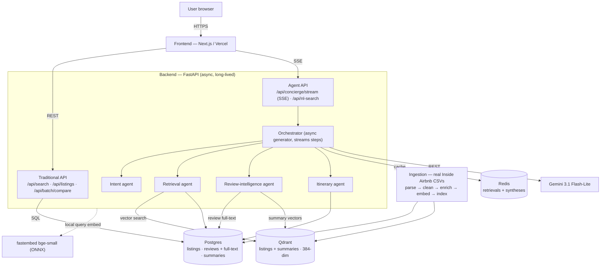

# Travel Discovery AI

AI-native travel discovery & booking — a Booking.com/Airbnb-style product surface with a multi-agent concierge brain underneath. Real booking UX (filters, map, listing pages, calendars, reviews) augmented by natural-language search, semantic retrieval, grounded review synthesis, and multi-stop itinerary planning, over **real Inside Airbnb data** for **Amsterdam, Lisbon, and Los Angeles**.

## Project status

| Phase | Scope | Status |
|---|---|---|
| 1 — Data layer | Real Inside Airbnb ingestion (3 cities), enrichments, embeddings | ✅ done |
| 2 — Traditional API | Search/filter/sort, availability, detail, reviews, compare | ✅ done & verified |
| 3 — Multi-agent concierge | Intent / Retrieval / Review-intel / Itinerary, SSE streaming | ✅ done & verified |
| 4 — Frontend booking surface | Filters, cards, map↔list, detail, wishlist, compare | ✅ done & verified |
| 5 — Frontend AI integration | NL search bar + chips, streaming concierge UI | ✅ done & verified |
| 6 — Deployment | Public URL (Render + Vercel + Neon + Qdrant Cloud + Upstash) | ✅ done & live |

**Live demo:** frontend → https://travel-discovery-ai.vercel.app · backend → https://travel-discovery-api.onrender.com (`/docs`). The backend runs on Render free tier, so the **first request after idle cold-starts in ~40–50s** — give it a moment, or it may already be warm.

> **Data:** real Inside Airbnb (detailed CSVs) — **50,000 listings** (Amsterdam 10,480 + Lisbon 19,760 + Los Angeles 19,760) + **200,000 reviews** (66,667/city) + 50,000 per-property summaries.

## Architecture



Two design choices worth calling out up front (both forced by a 4-core dev machine + free-tier limits, both detailed in [Trade-offs](#key-trade-offs)):
- **Reviews are not vector-embedded.** All 200K live in Postgres with a full-text index; the Review-intelligence agent ranks a property's reviews by Postgres full-text (focus-aware) and the LLM synthesizes/cites the real rows. We embed **listings + per-property summaries** into Qdrant instead.
- **Availability is computed, not stored** — a deterministic `hash(listing_id, date)` gives per-night availability + price from the listing's real base price, avoiding ~18M calendar rows.

## Stack & the "why"

| Layer | Choice | Why |
|---|---|---|
| Frontend | Next.js on **Vercel** | Free CDN + HTTPS; serverless is fine for the SPA |
| Backend | FastAPI on **Render** (Docker, long-lived) | SSE streaming needs a long-lived process — serverless timeouts would cut agent streams |
| Relational | **Postgres** (Neon free) | all listings + all review text (+ GIN full-text index) + summaries |
| Vector | **Qdrant** (Cloud free 1 GB) | `listings` + `summaries` @ 384-dim, cosine, int8. Relational/vector **split** is the brief's "justify the store split" |
| Cache | **Redis** (Upstash free) | retrievals + review syntheses cluster heavily |
| LLM | **Gemini 3.1 Flash-Lite** via REST; Claude Haiku fallback | cheap, fast, structured-JSON + SSE; over REST (the `google-generativeai` SDK is deprecated) |
| Embeddings | **bge-small-en-v1.5** (384-dim) via fastembed/ONNX, local (`threads=cpu_count`) | $0, no torch, fits Render free 512 MB; same model for corpus + query so vectors share one space |
| Agent framework | **custom async-generator orchestrator** | first-class SSE step streaming + exact per-step token/latency accounting, lighter than LangGraph/CrewAI for 4 cooperating agents |

## Data choice

**Real Inside Airbnb data** (the *detailed* `listings.csv` / `reviews.csv` exports) for **Amsterdam, Lisbon, Los Angeles**. Each listing carries real `name`, `room_type`, `neighbourhood`, lat/lng, `price`, `amenities`, `picture_url`, `beds`/`accommodates`, and `review_scores_rating`; each review carries the real `comments` text.

The ingestion pipeline (`ingestion/ingest.py`, re-runnable) parses the CSVs, cleans prices (`$1,234.00` → float, median-imputed if missing), normalizes the free-form `amenities` JSON to an 18-term canonical vocabulary, detects each review's language (`langdetect`), builds ≥4-photo galleries from real `picture_url`s, runs ingest-time enrichments (aspect sentiment, per-property summary, neighbourhood price percentile, amenity normalization), and indexes into Postgres + Qdrant.

*Why real data:* credibility and genuine review text for the AI layer. *Why these three cities:* together they comfortably exceed the brief's 50K-listing floor while staying within free-tier storage; Amsterdam (10,480) anchors a smaller market, Lisbon and Los Angeles the larger ones.

## Key trade-offs

1. **Reviews are kept in Postgres (full-text), not vector-embedded.** On a 4-core dev CPU, embedding 200K real (long) review texts is ~15 h. So we embed **listings + per-property summaries** (~100K short vectors, ~5 h) and serve review search from Postgres full-text. *Effect:* per-property review retrieval is **fast** (indexed `listing_id` slice) — no latency penalty; the trade-off is **semantic recall** (keyword/stemming vs. embedding similarity), mitigated by the **summary vectors** (property-level semantic), the LLM reading the real review rows for synthesis, and synonym-expandable `tsquery`. The brief's review intelligence is property/candidate-scoped, where this is a non-issue.
2. **Listing split is 10,480 / 19,760 / 19,760 (= 50K), not equal.** Amsterdam only has 10,480 listings, so a true 3-way equal split can't reach 50K; we take all of Amsterdam and split the remainder across Lisbon/LA. Reviews *are* equal (66,667/city).
3. **Aspect sentiment is heuristic (English-mostly).** Real reviews are multilingual; the offline keyword heuristic mainly scores English. The LLM path (`--use-llm`) is built + throttled/retried but free-tier quota + volume make it impractical at 200K; documented rather than half-run.
4. **Per-review rating isn't in the source** (Inside Airbnb reviews have no per-review stars) → stored null; listing-level `review_scores_rating` drives the rating filter/sort. **Language** is detected at ingest (`langdetect`).
5. **Deterministic calendar.** The 426 MB+ `calendar.csv` files (Lisbon's has no per-night price) are not loaded; availability + per-night price are computed deterministically from the listing's real base price. Trade-off: availability is synthetic, not the real Airbnb calendar.
6. **Photos: ≥4 per listing** = the real hero `picture_url` + extras drawn deterministically from a same-city pool of real `picture_url`s (the detailed CSV has only one image per listing). All real Airbnb-CDN images; galleries reuse images across listings (normal for stock-style booking imagery).
7. **384-dim embeddings** (not 1536) — keeps the corpus inside Qdrant's free 1 GB; small quality trade-off for big footprint/cost savings.
8. **Availability filter applies post-DB-pagination**, so search `total` reflects pre-availability counts (acceptable at this scale).

## Known limitations

- No per-review semantic vector search (see trade-off #1); cross-property "find any review that says X" is keyword-based.
- Aspect scores / topic filtering are sparse on non-English reviews.
- Calendar availability is synthetic (deterministic), not the real Inside Airbnb calendar.
- A global review full-text (GIN) index is ~100–200 MB at 200K reviews — fine locally, watch it on the 0.5 GB free-tier Postgres (per-property lookups don't even need it).
- Embedding all 200K reviews would need a GPU / faster host or a cloud embedding API (deferred — see trade-off #1).
- Backend is on Render's free tier, so it spins down after 15 min idle (~40–50s cold start on the next request); a keep-warm ping mitigates this for demos.

## One-command local run

```bash
cp .env.example .env          # set GEMINI_API_KEY (or LLM_PROVIDER=anthropic + ANTHROPIC_API_KEY)
docker compose up -d --build  # postgres + qdrant + redis + backend + frontend
# Load data — either:
#  (a) restore the pre-built Postgres dump + Qdrant snapshot (fast):
gh release download deploy-data-v1 -D dumps   # fetch artifacts from the GitHub Release
bash scripts/restore_local.sh                 # pg_restore + Qdrant snapshot recover
#  (b) OR re-ingest from the Inside Airbnb detailed CSVs in csvData/{amsterdam,lisbon,los angeles}/:
docker compose run --rm ingestion python ingest.py --scale full --recreate-qdrant
```

Produce/refresh the artifacts yourself with `bash scripts/export_data.sh` (writes `dumps/`), then `bash scripts/publish_artifacts.sh` to push them to the Release.

- Frontend: http://localhost:3000 · Backend + docs: http://localhost:8000/docs
- The raw CSVs (~1.5 GB) are **not** committed (gitignored). For a clean reproduction, download them from [Inside Airbnb](https://insideairbnb.com/get-the-data/) into `csvData/`, or restore the dump+snapshot. See [ingestion/README.md](./ingestion/README.md).

## Repo layout

| Path | What | Docs |
|---|---|---|
| `backend/` | FastAPI: traditional search/filter API + streaming multi-agent concierge | [backend/README.md](./backend/README.md) |
| `frontend/` | Next.js booking-style product surface + conversational concierge | [frontend/README.md](./frontend/README.md) |
| `ingestion/` | Re-runnable real-CSV ingestion pipeline | [ingestion/README.md](./ingestion/README.md) |
| `docker-compose.yml` | Full local stack | — |

## What I'd change with another week

- **Embed all 200K reviews** for full per-review semantic search — on a GPU box or via a cloud embedding API (the only real blocker here is the 4-core CPU).
- **LLM (or fine-tuned) multilingual aspect sentiment** + LLM per-property summaries at a paid tier.
- Move deployment to a **single always-on VM** (Oracle Always-Free / Hetzner ~€4/mo) running the exact `docker-compose`.
- **Materialized calendar** (or PostGIS) so availability filtering is pre-pagination; migrate Qdrant `.search` → `query_points`.

## Rough cost per query (back-of-envelope)

Measured from a live concierge trace: ~**800 input / ~270 output tokens** per multi-agent query (intent + itinerary/synthesis + answer). At Gemini 3.1 Flash-Lite rates (~$0.10 / $0.40 per 1M in/out, approximate):

- **Traditional search/filter:** **$0** (no LLM; query embedding is local).
- **NL search (intent only):** ~**$0.0001**/query.
- **Full concierge query:** ~**$0.0003–0.001**/query; Redis caching pushes repeat-query cost toward $0.

Per-query cost is independent of corpus size; the one-time cost is bulk embedding at ingest (~5 h CPU for 100K vectors here; pennies of LLM if enrichments run on the paid tier).

## Evaluation

See [EVAL.md](./EVAL.md) for the golden-query set, scoring rubric, and grounding/citation checks.

## Out of scope (per brief)

No auth/accounts, no real payments/booking (Reserve is mocked), stays-only (no flights), no HA/multi-region/autoscaling, laptop-responsive only, no branding.

## Time spent

**~40 hours** across the six phases — roughly: data layer + re-runnable ingestion ~10h, traditional API ~5h, multi-agent concierge + backend craft ~11h, frontend booking surface ~10h, deployment + docs/eval ~4h.

## Deployment (Path A — free tier)

Managed PaaS, no VM/SSH/manual TLS. **Order matters — data stores first, backend next, frontend last.** Infra is declared in [`render.yaml`](./render.yaml) (backend Blueprint); Vercel deploys the frontend git-natively.

1. **Provision data stores** — create a **Neon** Postgres project, a **Qdrant Cloud** free cluster (1 GB), and an **Upstash** Redis database; copy each connection string + the Qdrant API key.
2. **Restore data (not re-ingest)** — fetch the pre-built artifacts and restore to the cloud stores:
   ```bash
   gh release download deploy-data-v1 -D dumps
   export DATABASE_URL='postgresql://…neon.tech/neondb?sslmode=require'
   export QDRANT_URL='https://…cloud.qdrant.io:6333'  QDRANT_API_KEY='…'
   bash scripts/restore_remote.sh        # restores Neon + Qdrant Cloud, prints counts
   ```
3. **Backend (Render)** — New → **Blueprint** → connect the repo (reads `render.yaml`, builds `backend/Dockerfile`). Fill the `sync: false` env vars in the dashboard (see table below) — **never bake keys into the image**. Add a [cron-job.org](https://cron-job.org) ping to `/health` every ~10 min to defeat the 15-min free-tier spin-down.
4. **Frontend (Vercel)** — import the repo, set **Root Directory = `frontend/`**, and `NEXT_PUBLIC_API_URL` = the Render URL.
5. **Wire + verify** — set `CORS_ORIGINS` on Render to the `https://<app>.vercel.app` origin; confirm SSE streams over HTTPS end-to-end (no mixed-content, no proxy buffering — the SSE route sends `X-Accel-Buffering: no`).

**Secrets checklist** (set in the Render dashboard; values never committed):

| Env var | Source | Where to set |
|---|---|---|
| `DATABASE_URL` | Neon → connection string | Render |
| `QDRANT_URL` + `QDRANT_API_KEY` | Qdrant Cloud → cluster URL + API key | Render |
| `REDIS_URL` | Upstash → `rediss://` URL | Render |
| `GEMINI_API_KEY` | Google AI Studio | Render |
| `ANTHROPIC_API_KEY` | console.anthropic.com (optional fallback) | Render |
| `CORS_ORIGINS` | your Vercel origin, e.g. `https://app.vercel.app` | Render |
| `NEXT_PUBLIC_API_URL` | the Render backend URL | Vercel |

Non-secret vars (`LLM_PROVIDER`, `GEMINI_MODEL`, `EMBEDDING_*`, `CACHE_TTL_SECONDS`) are pre-set in `render.yaml`.
