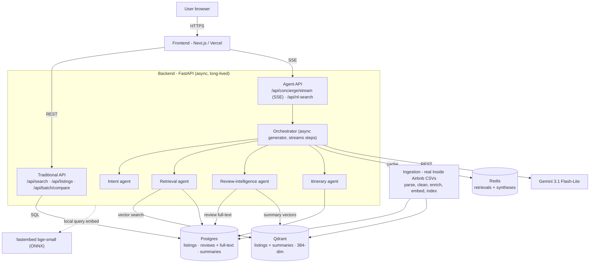

# Travel Discovery AI

A Booking.com / Airbnb style stays product with a multi-agent concierge underneath. You get the normal booking experience you'd expect (filters, a map, listing pages, calendars, reviews), plus natural-language search, semantic retrieval, grounded review summaries, and multi-stop trip planning. It all runs on real Inside Airbnb data for Amsterdam, Lisbon, and Los Angeles.

## Status

v1 (phases 1-6) is built and deployed. **v2 is in progress on the `v2-agentic` branch** and
is not yet deployed — see [v2 status](#v2--agentic-platform-in-progress) below.

| Phase | Scope | Status |
|---|---|---|
| 1. Data layer | Real Inside Airbnb ingestion (3 cities), enrichments, embeddings | Done |
| 2. Traditional API | Search/filter/sort, availability, detail, reviews, compare | Done & verified |
| 3. Multi-agent concierge | Intent / Retrieval / Review-intel / Itinerary, SSE streaming | Done & verified |
| 4. Frontend booking surface | Filters, cards, map+list, detail, wishlist, compare | Done & verified |
| 5. Frontend AI integration | NL search bar + chips, streaming concierge UI | Done & verified |
| 6. Deployment | Public URL (Render + Vercel + Neon + Qdrant Cloud + Upstash) | Done & live |

### v2 — agentic platform (in progress)

v2 makes the platform agentic: it remembers the traveller, calls external tools, and
exposes itself as a tool other agents can use. Work is on `v2-agentic` and runs locally
against the same stack; **none of it is deployed yet.**

| Workstream | Scope | Status |
|---|---|---|
| WS7 · CI | GitHub Actions: ruff + pytest + docker build, LLM mocked | Written, **never run on GitHub** (nothing pushed) |
| WS0 · Debt paydown | Review sampler, token accounting, service layer, summary-vector retrieval, area aliases, composite routing, repro/drift fixes | Done, verified live |
| WS1 · Memory | Traveller + trip memory (mem0), dealbreakers as hard filters, memory panel | Done, verified live |
| WS0-A · LLM summaries | Per-property LLM summaries for a top-N subset | Not started |
| WS2 · MCP | Expose the platform as an MCP server; consume an external one | Done, verified live (not deployed) |
| WS3 · LangGraph planner | New graph flow with cycles + HITL interrupt/resume | Not started |
| WS4/5/6 | Cross-encoder reranking, model benchmark, booking-document OCR | Not started |

Measured against the 512 MB Render free tier with memory active: **382 MB RSS**, leaving
~130 MB for WS4's cross-encoder. Gemini calls per turn stay within the ≤4 ceiling
(3 on `search`, 4 on `review`/`itinerary`/composite) — see
[backend/README.md](./backend/README.md#memory-ws1).

Tests: **234 backend** (pytest, LLM mocked, zero quota) and **12 Playwright e2e**.

**Live demo (v1):** frontend at https://travel-discovery-ai.vercel.app, backend at https://travel-discovery-api.onrender.com (API docs at `/docs`). Heads up: the backend is on Render's free tier, so the very first request after it's been idle takes ~40-50s to wake up. After that it's quick. It may already be warm when you try it.

The data is real Inside Airbnb (the detailed CSV exports): 50,000 listings (10,480 in Amsterdam, 19,760 in Lisbon, 19,760 in Los Angeles) and 200,000 reviews, roughly 66,667 per city, plus a precomputed summary for each of the 50,000 properties.

## Architecture


```mermaid
flowchart TD
    U[User browser] -->|HTTPS| FE["Frontend - Next.js / Vercel"]
    FE -->|REST| API
    FE -->|SSE| STREAM

    subgraph BE["Backend - FastAPI (async, long-lived)"]
        API["Traditional API<br/>/api/search · /api/listings · /api/batch/compare"]
        STREAM["Agent API<br/>/api/concierge/stream (SSE) · /api/nl-search"]
        ORCH["Orchestrator (async generator, streams steps)"]
        STREAM --> ORCH
        ORCH --> AINT[Intent agent]
        ORCH --> ARET[Retrieval agent]
        ORCH --> AREV[Review-intelligence agent]
        ORCH --> AITI[Itinerary agent]
    end

    API -->|SQL| PG[("Postgres<br/>listings · reviews + full-text · summaries")]
    ARET -->|vector search| QD[("Qdrant<br/>listings + summaries · 384-dim")]
    ARET --> PG
    AREV -->|review full-text| PG
    AREV -->|summary vectors| QD
    AITI --> PG
    ORCH -->|cache| RD[("Redis<br/>retrievals + syntheses")]
    ORCH -->|REST| LLM["Gemini 3.1 Flash-Lite"]
    BE -.->|local query embed| EMB["fastembed bge-small (ONNX)"]

    ING["Ingestion - real Inside Airbnb CSVs<br/>parse, clean, enrich, embed, index"] --> PG
    ING --> QD
```

Two upfront calls shaped most of this, and both came out of running it on a 4-core laptop against free-tier limits (more detail in [Trade-offs](#key-trade-offs)):

- I don't vector-embed the reviews. All 200K of them live in Postgres behind a full-text index. The review agent ranks a property's reviews with Postgres full-text search, and the LLM summarizes and cites the actual rows. What I do put in Qdrant is the listings plus a per-property review summary.
- Availability isn't stored either. A deterministic `hash(listing_id, date)` gives me the per-night availability and price off the listing's real base price, which saves about 18M calendar rows.

## Stack, and why I picked each piece

| Layer | Choice | Why |
|---|---|---|
| Frontend | Next.js on Vercel | Free CDN and HTTPS, and serverless is fine for an SPA |
| Backend | FastAPI on Render (Docker, long-lived) | SSE streaming needs a long-lived process; serverless timeouts would cut the agent streams off |
| Relational | Postgres (Neon free) | All listings, all review text with a GIN full-text index, and the summaries |
| Vector | Qdrant (Cloud free 1 GB) | `listings` + `summaries` at 384-dim, cosine, int8. Keeping relational and vector separate is the "justify the store split" the brief asks for |
| Cache | Redis (Upstash free) | Travel queries repeat a lot, so caching retrievals and syntheses pays off |
| LLM | Gemini 3.1 Flash-Lite over REST, with a Claude Haiku fallback | Cheap, fast, does structured JSON and SSE. I call it over REST because the `google-generativeai` SDK is deprecated |
| Embeddings | bge-small-en-v1.5 (384-dim), fastembed/ONNX, local | Costs nothing, no torch, fits Render's free 512 MB. Same model at ingest and query time so the vectors share one space |
| Agent framework | A custom async-generator orchestrator | I wanted first-class SSE step streaming and exact per-step token/latency numbers. For 4 cooperating agents that's lighter than pulling in LangGraph or CrewAI |

## Why this data

I went with real Inside Airbnb data (the *detailed* `listings.csv` / `reviews.csv` exports) for Amsterdam, Lisbon, and Los Angeles. Every listing has a real `name`, `room_type`, `neighbourhood`, lat/lng, `price`, `amenities`, `picture_url`, `beds`/`accommodates`, and `review_scores_rating`, and every review has its real `comments` text.

The ingestion pipeline (`ingestion/ingest.py`, and it's re-runnable) parses the CSVs, cleans the prices (`$1,234.00` becomes a float, median-imputed when missing), normalizes the free-form `amenities` JSON down to an 18-term vocabulary, detects each review's language with `langdetect`, builds galleries of at least 4 photos from the real `picture_url`s, runs the ingest-time enrichments (aspect sentiment, per-property summary, neighbourhood price percentile, amenity normalization), and indexes everything into Postgres and Qdrant.

I picked real data because it's more credible and gives the AI layer genuine review text to work with. These three cities together clear the brief's 50K-listing floor while still fitting the free tiers. Amsterdam (10,480) is the smaller market and Lisbon and LA are the larger ones.

## Key trade-offs

1. Reviews stay in Postgres full-text instead of being vector-embedded. Embedding 200K real (and often long) review texts on a 4-core CPU is roughly 15 hours, so I embed the listings plus per-property summaries instead (about 100K short vectors, ~5 hours) and serve review search from Postgres full-text. Per-property review retrieval stays fast because it's an indexed `listing_id` slice, so there's no latency hit. The cost is semantic recall (keyword/stemming vs embedding similarity), softened by the per-property summary vectors, the LLM reading the real rows during synthesis, and synonym-expandable `tsquery`. One correction worth recording: for most of v1 the summary vectors did *not* soften anything — the `summaries` collection was built, snapshotted and restored, but no code ever queried it, so a review-theme query fell through to name/keyword matching. Retrieval now searches it alongside the listing vectors and fuses the two by reciprocal rank, so the claim finally holds. The brief's review intelligence is scoped to a property or candidate set, where this basically doesn't bite.
2. The listing split is 10,480 / 19,760 / 19,760 (= 50K), not even. Amsterdam only has 10,480 listings, so an even 3-way split can't reach 50K. I take all of Amsterdam and split the rest across Lisbon and LA. Reviews are even at 66,667/city.
3. Aspect sentiment is a heuristic and mostly English. Real reviews are multilingual, but the offline keyword heuristic mainly scores English. There's an LLM path (`--use-llm`) that's built, throttled, and retried, but free-tier quota plus the volume make it impractical at 200K, so I documented it rather than half-running it.
4. The source has no per-review rating (Inside Airbnb reviews don't carry per-review stars), so I store null and let the listing-level `review_scores_rating` drive the rating filter and sort. Language is detected at ingest with `langdetect`.
5. The calendar is deterministic. The `calendar.csv` files are 426 MB+ (and Lisbon's has no per-night price), so I don't load them. Availability and per-night price are computed from the listing's real base price instead. The trade-off is that availability is synthetic, not the real Airbnb calendar.
6. Each listing gets at least 4 photos: the real hero `picture_url` plus extras pulled deterministically from a same-city pool of real `picture_url`s (the detailed CSV only ships one image per listing). They're all real Airbnb-CDN images, and galleries reuse images across listings, which is normal for stock-style booking imagery.
7. Embeddings are 384-dim, not 1536. That keeps the whole corpus inside Qdrant's free 1 GB. Small quality trade-off for a big footprint and cost saving.
8. The availability filter runs after DB pagination, so the search `total` reflects the pre-availability count. Fine at this scale.

## Known limitations

- No per-review semantic vector search (see trade-off #1), so a cross-property "find any review that mentions X" is keyword-based.
- Aspect scores and topic filtering are sparse on non-English reviews.
- Calendar availability is synthetic (deterministic), not the real Inside Airbnb calendar.
- A global review full-text (GIN) index is ~100-200 MB at 200K reviews. That's fine locally, but worth watching on the 0.5 GB free Postgres. Per-property lookups don't even need it.
- Embedding all 200K reviews would need a GPU, a faster host, or a cloud embedding API (deferred, see trade-off #1).
- The backend is on Render's free tier, so it spins down after 15 minutes idle (~40-50s cold start on the next request). The keep-warm ping is **not actually configured yet** — an earlier version of this README claimed it was.

### v2 limitations (memory, `v2-agentic` branch)

- **Identity is a localStorage UUID, not authentication.** Same-browser persistence only: clear site data or switch device and you are a new traveller. Anyone holding the id can read those memories, so nothing sensitive should be stored under one. `DELETE /api/memory/{id}` is deliberately not authorization-bearing.
- Memory is **not deployed** — it runs locally only. mem0 adds ~117 MB of imports and a second embedding model, both of which are baked into the image rather than fetched at runtime.
- The guard that stops remembered text populating hard filters (`city`, dates, budget) is heuristic: it drops a value traceable to memory but not to this turn's request. It fails safe (widens results rather than silently narrowing), but it can drop a value the traveller did state.
- mem0 pulls the `openai` SDK in as a hard dependency. It is installed but never used — no OpenAI key is configured, and `assert_local_and_gemini()` fails startup loudly if mem0 has silently fallen back to a remote provider.

## MCP — both directions

v2 makes the platform an MCP **server** and an MCP **client**. Both halves run locally
today; neither is deployed yet. Full spec: [`version2/WS2_MCP.md`](./version2/WS2_MCP.md).

### Outbound — the platform as a tool other agents call

Six tools at `/mcp`, **mounted into the existing FastAPI app** rather than run as a
separate service, so they share the asyncpg pool, Qdrant client and Redis cache and stay
inside one Render service (one deploy, one cold start, one keep-warm ping).

| Tool | Cost | Notes |
|---|---|---|
| `search_listings` | 0 LLM | semantic + filters, the workhorse |
| `get_listing_detail` | 0 LLM | gallery, amenities, aspect scores, price breakdown |
| `check_availability` | 0 LLM | deterministic availability function |
| `compare_listings` | 0 LLM | matrix only — deliberately **not** the AI verdict path |
| `synthesize_reviews` | 1 LLM | grounded, `[r#]` citations to real review rows |
| `plan_itinerary` | 1 LLM | multi-stay plan with real costs |

What makes this more than a CRUD wrapper is `synthesize_reviews`: it is backed by the
review-intelligence agent, so a calling agent gets **citations it can verify** against
200K real reviews — and an explicit `abstained` flag with a reason when there is no
evidence, rather than a confident-sounding summary of nothing.

**Tool docstrings are written for the calling model, not for a human reader.** The
docstring *is* the schema an agent sees when deciding whether to call a tool, so each
declares its grounding guarantee, its LLM cost, its abstention behaviour, and real enum
values verbatim. This is the cheapest quality win in the whole workstream.

`compare_listings` maps to a verdict-free service path on purpose: the HTTP endpoint
(`POST /api/batch/compare`) spends up to 5 LLM calls building an AI verdict, and a
browsing agent must not silently burn that quota.

Auth is a bearer token enforced as **ASGI middleware** — transport-agnostic, and immune
to fastmcp's auth API changing between versions. It fails **closed**: an unset
`MCP_API_KEY` returns 503 rather than serving an open endpoint, because two of the six
tools spend Gemini quota. There is a per-key RPM cap on those two only.

### Inbound — the platform consuming an external tool

`backend/app/weather.py` calls a weather MCP server from `plan_itinerary`, once per plan
(not per stay), after the segment structure and dates are settled. The forecast lands in
`plan["notes"]`, which the answer prompt already surfaces — so an external tool visibly
changes the recommendation rather than sitting in the architecture diagram.

The note is built **deterministically** from the returned rows (temperature range,
dominant condition, days with ≥50% rain probability), not passed through. That is the same
grounding rule as retrieval rationales and itinerary costs, and it is load-bearing here:
this particular server returns an *instruction to an LLM* plus hourly JSON, so passing its
text through verbatim put a wall of field documentation in front of the traveller.

Client discipline: one lazily-created client reused across requests, a **3-second hard
timeout**, Redis-cached 6h by `(city, date-range)`, and full silent degradation — a
third-party outage can never break a trip plan or the SSE stream. The call emits an
`AgentStep("weather_mcp", …)` so it is **visible in the SSE trace**; an invisible
integration is indistinguishable from no integration.

Zero Gemini calls — it is a tool call, not a completion.

### Running it

```bash
docker compose up -d                              # API + /mcp
docker compose --profile tools up -d weather-mcp  # the inbound half, local only
```

The weather server is profile-gated, so a plain `docker compose up` leaves it unreachable
— which means the **default local state exercises the degradation path**. That is
deliberate: it is the behaviour that has to work.

**The inbound half is local-only, by decision.** `WEATHER_MCP_URL` is left unset in
production, so the deployed itinerary agent simply produces no forecast note. The reason is
the instance-hours arithmetic below: a second free service could not be kept warm, so every
first call after idle would hit the 3s timeout and return nothing regardless — deploying it
would buy a worse version of the behaviour that already runs. The setting is still declared
in `render.yaml`, so turning it on later is a dashboard change, not a code change.

### Free-tier constraint, stated deliberately

Render's free plan is **750 instance-hours per month per account** — roughly one
near-always-on service. Keep-warm pinging both the API and a weather service is ~1460 h
and would exhaust the allowance partway through the month, **taking the main API down with
it**. So: ping only the API, and let weather cold-start and degrade on the 3s timeout.

### Known limitations

- **The outbound MCP server is not deployed yet**; it is verified locally. The inbound
  weather client is local-only *by decision* (see above), not by omission.
- Open-Meteo's forecast horizon is ~14 days, and `plan_itinerary` defaults to starting
  ~14 days out when the query carries no dates — so the default demo query often gets no
  weather note. Ask for dates within two weeks.
- `search_listings.min_rating` is applied **in Python after hydration**, not in Qdrant:
  `rating` is not one of the six indexed payload fields, and filtering an unindexed field
  in Qdrant Cloud's strict mode returns 400. The tool docstring says so.
- The RPM cap is in-process, matching this app's single-worker assumption. It is not a
  distributed rate limiter.

## One-command local run

```bash
cp .env.example .env          # set GEMINI_API_KEY (or LLM_PROVIDER=anthropic + ANTHROPIC_API_KEY)
docker compose up -d --build  # postgres + qdrant + redis + backend + frontend
# Load data, either:
#  (a) restore the pre-built Postgres dump + Qdrant snapshot (fast):
gh release download deploy-data-v1 -D dumps   # fetch artifacts from the GitHub Release
bash scripts/restore_local.sh                 # pg_restore + Qdrant snapshot recover
#  (b) or re-ingest from the Inside Airbnb detailed CSVs in csvData/{amsterdam,lisbon,los angeles}/:
docker compose run --rm ingestion python ingest.py --scale full --recreate-qdrant
```

If you want to rebuild the artifacts yourself, run `bash scripts/export_data.sh` (it writes `dumps/`) and then `bash scripts/publish_artifacts.sh` to push them to the Release.

- Frontend: http://localhost:3000, backend + docs: http://localhost:8000/docs
- The raw CSVs (~1.5 GB) aren't committed (they're gitignored). For a clean reproduction, grab them from [Inside Airbnb](https://insideairbnb.com/get-the-data/) into `csvData/`, or just restore the dump and snapshot. See [ingestion/README.md](./ingestion/README.md).

## Repo layout

| Path | What | Docs |
|---|---|---|
| `backend/` | FastAPI: traditional search/filter API + streaming multi-agent concierge | [backend/README.md](./backend/README.md) |
| `frontend/` | Next.js booking-style product surface + conversational concierge | [frontend/README.md](./frontend/README.md) |
| `ingestion/` | Re-runnable real-CSV ingestion pipeline | [ingestion/README.md](./ingestion/README.md) |
| `backend/app/memory/` | v2 traveller + trip memory (mem0), the only mem0 entry point | [backend/README.md](./backend/README.md#memory-ws1) |
| `backend/app/mcp_server/` | v2 MCP server — six tools at `/mcp`, bearer auth as ASGI middleware | [MCP section](#mcp--both-directions) |
| `backend/app/weather.py` | v2 MCP *client* — weather, consumed by the itinerary agent | [MCP section](#mcp--both-directions) |
| `version2/` | v2 strategy docs + requirement mapping | [`JD_MAPPING.md`](./version2/JD_MAPPING.md), `V2_MASTER_PLAN.md` |
| `docker-compose.yml` | Full local stack | - |

## What I'd do with another week

- Embed all 200K reviews for proper per-review semantic search, on a GPU box or via a cloud embedding API. The only real blocker here was the 4-core CPU.
- Move aspect sentiment and the per-property summaries to an LLM (or a fine-tuned model) on a paid tier so they work across languages.
- Move the deployment to a single always-on VM (Oracle Always-Free or a ~€4/mo Hetzner box) running the same `docker-compose`.
- Materialize the calendar (or add PostGIS) so the availability filter runs before pagination.

Several items from this list have since been done on `v2-agentic`: the Qdrant `.search`
calls are migrated to `query_points`, the summary vectors are actually queried and fused
into retrieval, "near downtown"-style constraints resolve to real neighbourhoods, and
composite queries ("find me X **and** tell me what guests say") now run both pipelines
instead of only one.

## Rough cost per query

From a live concierge trace, a multi-agent query is around 800 input and 270 output tokens (intent + itinerary/synthesis + the answer). At Gemini 3.1 Flash-Lite rates (roughly $0.10 / $0.40 per 1M in/out):

- Traditional search/filter: $0 (no LLM, and the query embedding is local).
- NL search (intent only): about $0.0001 per query.
- Full concierge query: about $0.0003 to $0.001 per query, and Redis caching pushes repeat queries toward $0.

Per-query cost doesn't depend on corpus size. The one-time cost is the bulk embedding at ingest (~5 hours of CPU for 100K vectors here, or a few pennies of LLM if the enrichments run on a paid tier).

## Evaluation

See [EVAL.md](./EVAL.md) for the golden-query set, the scoring rubric, and the grounding/citation checks.

## Out of scope (per the brief)

No auth or accounts, no real payments or booking (Reserve is mocked), stays only (no flights), no HA / multi-region / autoscaling, laptop-responsive only, no branding.

## Time spent

Roughly 40 hours across the six phases: data layer plus the re-runnable ingestion ~10h, the traditional API ~5h, the multi-agent concierge and backend work ~11h, the frontend booking surface ~10h, and deployment plus docs and eval ~4h.

## Deployment (Path A, free tier)

Managed PaaS, no VM, SSH, or manual TLS. Order matters: stand up the data stores first, then the backend, then the frontend. The backend infra is declared in [`render.yaml`](./render.yaml) (a Render Blueprint); Vercel deploys the frontend straight from git.

1. Provision the data stores. Create a Neon Postgres project, a Qdrant Cloud free cluster (1 GB), and an Upstash Redis database, and copy each connection string plus the Qdrant API key.
2. Restore the data instead of re-ingesting. Pull the pre-built artifacts and restore them into the cloud stores:
   ```bash
   gh release download deploy-data-v1 -D dumps
   export DATABASE_URL='postgresql://…neon.tech/neondb?sslmode=require'
   export QDRANT_URL='https://…cloud.qdrant.io:6333'  QDRANT_API_KEY='…'
   bash scripts/restore_remote.sh        # restores Neon + Qdrant Cloud, prints counts
   ```
3. Backend (Render). New, Blueprint, connect the repo (it reads `render.yaml` and builds `backend/Dockerfile`). Fill in the `sync: false` env vars in the dashboard (table below), and don't bake keys into the image. Add a [cron-job.org](https://cron-job.org) ping to `/health` every ~10 minutes to beat the 15-minute free-tier spin-down.
4. Frontend (Vercel). Import the repo, set Root Directory to `frontend/`, and set `NEXT_PUBLIC_API_URL` to the Render URL.
5. Wire it up and check. Set `CORS_ORIGINS` on Render to the `https://<app>.vercel.app` origin, then confirm SSE streams over HTTPS end to end (no mixed content, no proxy buffering; the SSE route sends `X-Accel-Buffering: no`).

Secrets checklist (set these in the Render dashboard; none of the values are committed):

| Env var | Source | Where to set |
|---|---|---|
| `DATABASE_URL` | Neon connection string | Render |
| `QDRANT_URL` + `QDRANT_API_KEY` | Qdrant Cloud cluster URL + API key | Render |
| `REDIS_URL` | Upstash `rediss://` URL | Render |
| `GEMINI_API_KEY` | Google AI Studio | Render |
| `ANTHROPIC_API_KEY` | console.anthropic.com (optional fallback) | Render |
| `CORS_ORIGINS` | your Vercel origin, e.g. `https://app.vercel.app` | Render |
| `NEXT_PUBLIC_API_URL` | the Render backend URL | Vercel |

The non-secret vars (`LLM_PROVIDER`, `GEMINI_MODEL`, `EMBEDDING_*`, `CACHE_TTL_SECONDS`) are already set in `render.yaml`.
